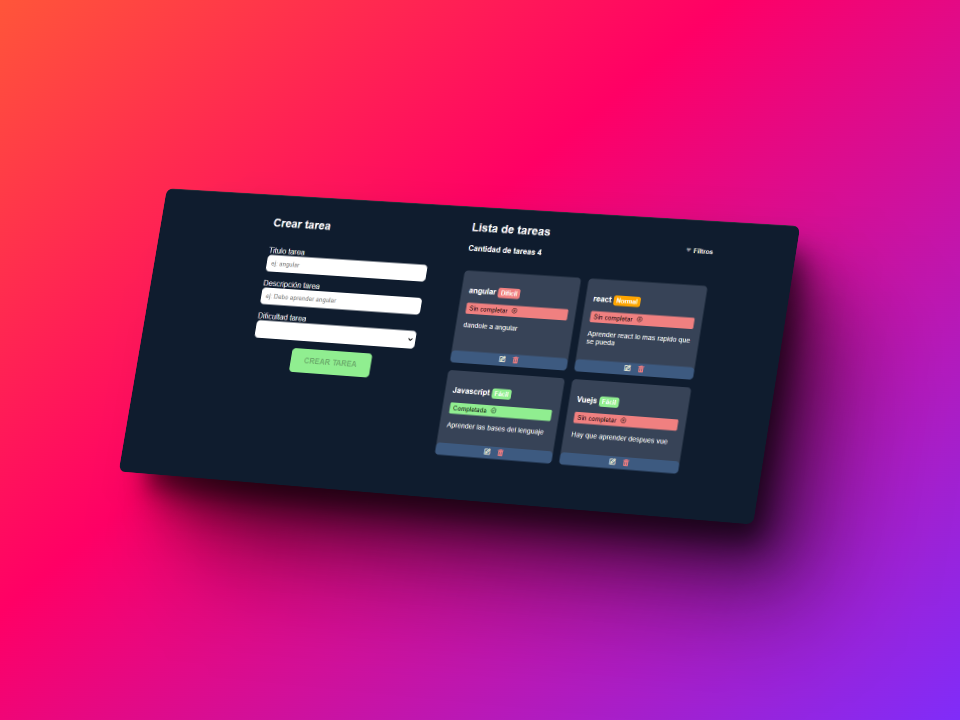

# Lista de Tareas en Angular

### [Demo de la app](https://todoangularbs.netlify.app)

La aplicación de Lista de Tareas en Angular ofrece una interfaz intuitiva para gestionar tareas con tres campos principales:

-   **Título:** Breve descripción de la tarea.
-   **Descripción:** Detalles adicionales sobre la tarea.
-   **Nivel de Dificultad:** Clasificación que indica la complejidad de la tarea.

Cada tarea nueva se agrega inicialmente como pendiente o no completada.

## Funcionalidades Principales

Después de ingresar una nueva tarea, la aplicación proporciona las siguientes funcionalidades:

-   **Eliminar:** La capacidad de eliminar una tarea de la lista.
-   **Editar:** Permite modificar los detalles de una tarea existente.
-   **Cambiar Estado de Completada:** Alternar entre el estado de completada y no completada, brindando flexibilidad en la gestión de tareas.

## Sistema de Filtros Integrado

La Lista de Tareas cuenta con un sistema de filtros para optimizar la experiencia del usuario, permitiendo visualizar distintos conjuntos de tareas:

-   **Todas las Tareas:** Muestra la lista completa de tareas.
-   **Todas las Tareas Fáciles:** Filtra y muestra solo las tareas clasificadas como fáciles.
-   **Todas las Tareas Normales:** Presenta las tareas con nivel de dificultad normal.
-   **Todas las Tareas Difíciles:** Filtra y muestra exclusivamente las tareas con nivel de dificultad alto.
-   **Todas las Tareas Completadas:** Muestra únicamente las tareas que se han marcado como completadas.
-   **Todas las Tareas Sin Completar:** Filtra y presenta las tareas que aún no han sido completadas.

Este sistema de filtros ofrece una experiencia de usuario personalizada y eficiente, permitiendo a los usuarios visualizar y gestionar sus tareas de manera más efectiva.
